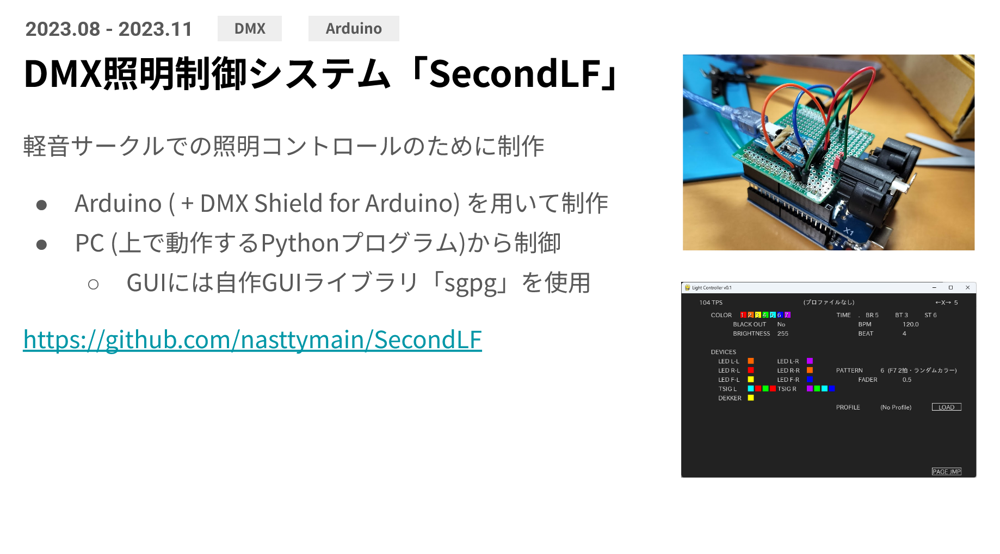

# SecondLF

## TL;DR

> ジャンパワイヤをハンダ付けするクソ配線はもうやめてます

## リンク
[ドキュメントページ](https://nasttymain.github.io/SecondLF/)

## これは何?
Arduino Uno + Arduino DMX Shield と PC を用いて、DMX照明を制御するためのプログラムです
2023年より、私自身が所属する軽音楽部で運用をしています

## 何ができるの?
- DMX 照明の制御
- **各 DMX 灯体をチャンネルではなく名前で管理できる**
  - 各灯体には、色・設定情報から実際の送信データを算出するための Python モジュール「ドライバ」を通して制御する
  - 同種灯体の増設が容易
- BPM ベースの点灯・フェーダースピード管理
- プリセット機能
- 設定ファイルによるキー割り当て機能
- 点灯パターンの増設
- 点灯状態のプレビューイメージ

## 何を使ってるの?
- Arduino
  - Arduino Uno R3 (運用先では互換機)
  - Arduino DMX Shield
  - 適当な USB シリアル変換器 (運用先では FT232 系)
- PC
  - これ
  - Python (>=3.9)
  - pygame
  - pySerial

## 回路図
// ToDo

## ソフトウェアマニュアル
// ToDo

## なんで自分で作ったの?
- DMX の仕組みを理解したかったから
- Arduino 側(と通信プロトコル)が内製なので制御ソフトウェア側も内製するのが筋だと思ったから
